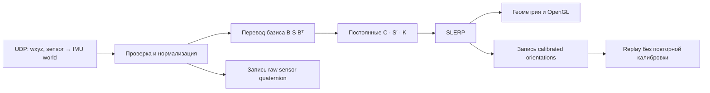

# Аудит quaternion pipeline собственной MoCap-системы

Дата: 2026-10-05. Область: готовые quaternion, host calibration, renderer и recorder.
Низкоуровневые IMU-алгоритмы, сырые accelerometer/gyroscope, частоты и firmware не изменяются.

## Конвенция, установленная до исправлений

`q_AB` переводит координаты вектора из B в A: `v_A = R(q_AB) v_B`.
Колонки R — оси B в координатах A. Поэтому `q_AC = q_AB * q_BC`.
Произведение Гамильтона активно вращает столбцы; правый множитель действует первым.
Incoming IMU: `wxyz`, sensor → собственная мировая система данного IMU.
Вывод пакетов подтверждён в ESP32-функциях отправки (Q id w x y z); host не инвертирует вход.
Физический смысл sensor→world задан входным контрактом и существующей геометрией локальной Y;
проверка направленными движениями на оборудовании выделена отдельно от этого контракта.
Noitom SDK: `xyzw`, joint → parent; адаптер переводит в `wxyz`, затем собирает joint → world.
Project world: X вправо, Y вперёд, Z вверх, правая тройка. Оси кости в нейтрали:
spine +Z, руки −Z. Локальная продольная ось sensor: слева +Y к кисти, справа −Y к кисти;
spine −Y вверх. Знак крепления рук подтверждён пользователем.

## Реальный pipeline до изменений

| Этап | Файл и функции | Операция |
|---|---|---|
| UDP | host/viz/pyqt_mocap/mpu_udp_viewer.py: _receive_loop, _process_events | байты, host monotonic timestamp, обработка в GUI |
| Parse/normalize/IDs | host/viz/pyqt_mocap/mocap_core.py: handle_datagram, validate_input_quaternion, _canonicalize | Q id wxyz; нормализация; canonical sensor ID |
| Basis | mocap_core.py: axis_map_matrix, mapped_sensor_quaternion | S′ = B S Bᵀ |
| Calibration basis | mocap_core.py: _mapped_segment_quaternion | M = C S′ C⁻¹ |
| Reference/drift/filter | mocap_core.py: _try_capture_neutral, set_guided_calibration, _update_segment_deltas | D = Exp(−rate·dt) M M₀⁻¹; SLERP |
| Calibration fitting | calibration.py / semaphore_calibration.py / t_pose_calibration.py | average poses, fit C, final A reference, estimate rate |
| Geometry | mocap_core.py: compute_body_pose | D rotates rest bone vectors; segment rotations are world, not parent-local |
| OpenGL | human_canvas_gl.py: update_pose; scripts/noitom_comparison/comparison_canvas.py | geometry from compute_body_pose; no second calibration |
| BVH | window_recording.py and host/storage/bvh.py | global segment matrices → local joint matrices → ZXY Euler |
| Experiment | scripts/noitom_comparison/comparison_window.py: _on_datagram_processed | raw normalized sensor wxyz AND already calibrated/smoothed orientations |
| Writer/replay | scripts/noitom_comparison/recording.py, replay.py | serialize unchanged; replay draws stored orientations without calibration |
| Noitom | noitom_adapter.py: sdk_rotation_to_project, world_transforms, orientations | xyzw → wxyz; B=(-x,z,y); parent composition; fixed rest correction on right; heading on left |

C is a world-basis alignment, not a physical right-side mounting offset.
Without drift and smoothing, the old formula is algebraically:
`D = C S′ S′₀⁻¹ C⁻¹ = C S′ K`, where `K = S′₀⁻¹ C⁻¹`.
Thus `q_world_alignment = C`, `q_world_sensor = S′`, `q_sensor_segment = K`.
With known target T₀, `K = S′₀⁻¹ C⁻¹ T₀`. This derivation fixes the order;
swapping C and K is not equivalent. Neutralization is a deliberate recalibration of K.

## Результаты первоначального аудита и исправления

1. Nonzero automatic host drift subtraction can move a constant incoming quaternion.
2. Profile import requests a fresh neutral instead of restoring the saved final A.
3. START unconditionally resets the neutral, including after profile load.
4. Pose averaging aligns signs to the first sample then averages quaternion components;
   it is sign-aware but not the SO(3) chordal mean for broad distributions.
5. Noitom conversion has two component reordering sites; central conversion required.
6. Existing A/T/Y calibration constrains longitudinal direction and plane of lift;
   anatomical absolute twist remains dependent on the chosen reference mounting.
7. Existing full-pose tests often use identity raw A rather than physical sensor mounting;
   add independent SciPy synthetic tests with arbitrary mounting and multiple poses.

Первоначальный аудит был записан до изменения реализации. Проверка пунктов и
результаты исправлений приведены ниже; аппаратная часть не объявляется завершённой.

## Подтверждённые ошибки downstream

| Проверка | До исправления | После исправления |
|---|---|---|
| Постоянный вход при сохранённой оценке 0,01 рад/с | Выход поворачивался на 17,1887° за 30 секунд | По умолчанию поправка дрейфа не применяется, выход постоянен; оценка сохраняется для диагностики |
| Импорт профиля | Сохранённая нейтраль заменялась следующим принятым кадром | Восстанавливается исходная нейтраль из профиля; совместимость с прежними версиями сохранена |
| STOP/START после калибровки | START запрашивал новую нейтраль | При существующей нейтрали START продолжает с прежней калибровкой |
| Среднее quaternion | Среднее компонентов после выбора знаков | Собственный вектор QᵀQ; совпадает с SO(3) chordal mean SciPy |
| Отказ A→T→A | Закрытие мастера, нет данных неудачной попытки в записи | Мастер остаётся открыт, повтор последней A или полный перезапуск; полные снимки этапов в событиях REC |

Quaternion algebra вынесена в `quaternion_utils.py`. Прежние импорты из
`mocap_core.py` сохранены. Noitom переводит xyzw/wxyz через общий конвертер.
`SegmentCalibration` хранит два постоянных преобразования и применяет
`q_WB = q_WW' * q_W'S * q_SB` ровно один раз. Контроль сигнатуры выявляет
изменение калибровочных преобразований вне явных операций настройки/нейтрализации.
Профиль версии 7 сохраняет эти преобразования и исходную нейтраль; импорт
восстанавливает эквивалентную модель. Обработка fusion/firmware не изменялась.



## Ошибка возврата правого предплечья 40,3°

Скриншот пользователя указывает `forearm.R`. Для A/T/Y-калибровки исходная
проверка направления математически эквивалентна сравнению двух сырых направлений:

`u_A = R(q_A) e_Y`, `u_return = R(q_return) e_Y`,
`angle = atan2(||u_A × u_return||, u_A · u_return)`.

Здесь e_Y = +Y слева и −Y справа. Действительно, подбор C обеспечивает
`C B R_A e_Y = d0`; поэтому старое выражение возврата
`C B R_return R_Aᵀ Bᵀ Cᵀ d0 = C B R_return e_Y` даёт тот же угол.
Постоянный поворот C B не меняет скалярное произведение. Теперь это сравнение
явно выполняется по raw Y, чтобы диагностика не зависела от последующих слоёв.
Знак quaternion и чистое вращение вокруг локальной Y не меняют результат.

Проверка записи `2026-10-05_21-02-34_277090_e65ada` независимым SciPy-кодом,
не вызывающим калибровочную модель. Окна от REC: 13,016–18,016 с и
33,016–38,016 с. Они выбраны вручную по участкам с опущенными руками:
в прежней версии нет точных меток мастера. Поэтому 42,05° является
воспроизведением расхождения на соседних интервалах, а не точным пересчётом 40,3°.

| Сегмент / sensor ID | Изменение направления raw Y своей системы | Изменение направления кости Noitom |
|---|---:|---:|
| shoulder.L / 7 | 6,78° | 4,39° |
| forearm.L / 6 | 5,77° | 7,34° |
| shoulder.R / 0 | 6,00° | 2,46° |
| forearm.R / 1 | **42,05°** | **5,11°** |

По 250 пакетов каждого IMU в каждом окне. 2000 ориентаций из байтов UDP
сопоставлены с сохранённым результатом разбора по timestamp **и FRAME header**
(timestamp в Windows может совпадать у соседних кадров). Максимальная разница
9,71·10⁻¹⁵°. Перестановки ID и компонентов между пакетом и моделью не обнаружено.
Изменения в таблице измерены отдельно внутри каждого потока; это не оценка
абсолютной точности костюмов и не несогласованный вычет двух мировых ориентаций.

Обнаруженное расхождение уже присутствует во входных данных правого предплечья;
оно не создаётся SLERP, сохранённой калибровкой, renderer или сменой знака q.
По этой записи нельзя установить, соответствует ли заявленная продольная Y
фактическому креплению и сохраняется ли физический смысл входной ориентации.
Диагноз низкоуровневому IMU не ставится. Ослабление порога замаскировало бы
несогласованность; порог 30° сохранён, допуск устойчивости позы остаётся 15°.
Новая попытка с точными метками нужна для локализации причины.

## Синтетическая проверка и профили

Независимый эталон — `scipy.spatial.transform.Rotation`: 120 случайных пар,
identity/inverse, известные оси, некоммутирующие произведения, векторы/матрицы,
SLERP, q/−q, среднее SO(3). Проверены произвольное крепление датчика и поворот
мира, одно измерение калибровки и несколько последующих поз; симметрия рук,
сгибание локтей, чистый twist, сохранение/загрузка/применение профиля.
Стабильный quaternion остаётся стабильным при ненулевой диагностической оценке
скорости. Повторная калибровка и reset нейтрали отделены от обычных кадров.

Регрессия ошибки пользователя: 40,3° swing только правого предплечья, большой
twist Y, разные мировые повороты и оба знака q. Прямое сравнение Y совпадает
с прежней проверкой геометрии. GUI проверяет отказ без применения профиля,
сохранение свидетельств в реальном writer, повтор конечной A и полный restart.

## Доступные реальные записи и ограничения

Запись 19:56 содержит один старый профиль `guided_poses`, созданный до REC.
Он не считается новой повторной калибровкой. Остаточные ошибки направления
по пяти позам после восстановления профиля:

| Сегмент | Среднее | Максимум |
|---|---:|---:|
| shoulder.L | 15,91° | 27,37° |
| forearm.L | 12,26° | 27,34° |
| shoulder.R | 12,15° | 22,48° |
| forearm.R | 15,30° | 26,86° |

Spine выключен и не считается аппаратной проверкой. Этот профиль не является
результатом нового A→T→A и не доказывает точность его работы.

В записи 20:53: 53 600 входных quaternion, нечисловых/невалидных значений 0,
норма 0,999999116…1,000000926; p95 отклонения нормы 5,40·10⁻⁷.
Запись помечена incomplete из-за stale/disconnect; успешно применённых новых
профилей нет. Запись 21:02 также incomplete. Пять живых повторов ещё не получены:
их нельзя заменять пятью копиями профиля или неудачными попытками.

`calibration_analyzer.py` выводит направления, полную ориентацию, twist,
повторяемость, input/output изменения и локтевые relative rotations. Последние
сравниваются лишь после постоянного согласования мира и каждого сегмента по
явно заданному статическому интервалу. При изменении калибровки/heading сравнение
обрывается до события; если событие внутри опорного окна, результат отклоняется.
Время — приём на host, не аппаратная синхронизация. Нет достоверной статической
опоры в имеющихся записях — численная межсистемная точность не объявляется.

Тест многопозовой оптимизации выполнен только офлайн. SciPy least_squares на
старом профиле с фиксированным world alignment сошёлся, но ориентационные
невязки предплечий достигают 85,50° слева и 74,36° справа. Canonical target twist
там лишь допущение: известные направления костей не задают полную ориентацию.
Это не основание внедрять такую поправку или заявлять улучшение точности.

Остаётся выполнить после устранения отказа: пять физических калибровок при
неизменном креплении; A 20–30 с; десять A/T/A; отдельные локти; несколько
пространственных ориентаций. Для текущего отказа сначала нужна одна попытка
с новым журналом. Неподвижность и фактическое крепление нельзя доказать unit-тестом.

Документация эталона: [Rotation.from_quat](https://docs.scipy.org/doc/scipy/reference/generated/scipy.spatial.transform.Rotation.from_quat.html),
[Rotation.mean](https://docs.scipy.org/doc/scipy/reference/generated/scipy.spatial.transform.Rotation.mean.html),
[порядок композиции](https://docs.scipy.org/doc/scipy/reference/generated/scipy.spatial.transform.Rotation.__mul__.html).

## Запуск диагностики

Рабочий каталог — корень репозитория. Установленная `.venv` содержит SciPy;
для нового окружения он входит в extra `analysis`. Live viewer SciPy не импортирует.

```powershell
.venv/Scripts/python.exe -m scripts.diagnostics.orientation.calibration_analyzer --session recordings/SESSION --output output/orientation/SESSION
.venv/Scripts/python.exe -m scripts.diagnostics.orientation.calibration_analyzer --session recordings/SESSION --static-start 120 --static-duration 5 --hold-duration 28 --output output/orientation/SESSION
.venv/Scripts/python.exe -m scripts.diagnostics.orientation.calibration_analyzer --profile profile.json --compare-multipose --output output/orientation/profile
.venv/Scripts/python.exe -m scripts.diagnostics.orientation.return_pose_check --session recordings/2026-10-05_21-02-34_277090_e65ada --a-start 13.016 --return-start 33.016 --output output/orientation/return-check/analysis.json
```

120 в примере — явно известное начало неподвижной A-позы в секундах от REC,
его нельзя без проверки переносить в другую запись. Без `--static-start` анализатор
использует последнюю метку «Совместить направление» + 2 с только при условии,
что затем действительно удерживалась A-поза.

Вывод: `analysis.json`, `pose_residuals.csv`, `repeatability.csv`,
`comparison_errors.csv`, `static_drift.csv`, `rejected_calibrations.csv`.
Пустой CSV означает отсутствие соответствующих данных, а не нулевую ошибку.
Отклонённые попытки не считаются применёнными профилями. `--profile` можно повторять.
Кандидаты многопозовой поправки не применяются и не записываются в исходный профиль.
Исходные записи только читаются; вывод внутрь анализируемой записи запрещён.
Папки records, recordings, output исключены из Git и не находятся в индексе.

Проверка после исправлений: `python -m pytest -m 'not hardware' -q` —
185 passed, 1 skipped (тест с внешним Blender), 27,54 с.
Отдельно после добавления проверки raw UDP: `test_return_pose.py` — 1 passed;
проверены совпадающие timestamp, различение FRAME, смена знака q и отклонение 40,3°.
