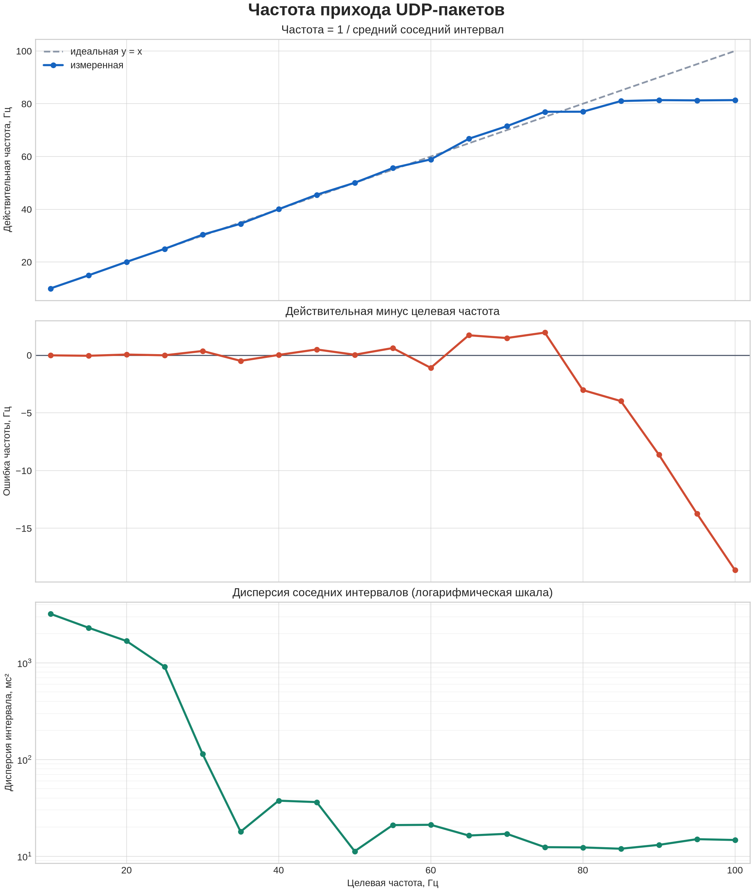

# Отчёт о проделанной работе

**Дата:** 6 августа 2026 года  
**Тема:** Исследование зависимости действительной частоты прихода UDP-пакетов от целевой частоты

## 1. Цель работы

Целью работы являлась обработка результатов измерения времён прихода UDP-пакетов и определение зависимости действительной частоты их приёма от частоты, заданной на контроллере ESP32.

Для достижения цели требовалось:

- вычислить интервалы между соседними временными метками;
- определить средний межпакетный интервал;
- вычислить дисперсию межпакетных интервалов;
- пересчитать средний интервал в действительную частоту;
- сравнить действительную и целевую частоты;
- представить результаты в табличной и графической форме.

## 2. Исходные данные

Исходные временные метки находятся в файле `frequency_timestamps.csv`. Каждый столбец таблицы соответствует одной целевой частоте, указанной в заголовке столбца. Строки содержат времена прихода последовательных UDP-пакетов в секундах.

В таблице предусмотрены целевые частоты от 10 до 150 Гц с шагом 5 Гц. На момент анализа заполнены столбцы от 10 до 100 Гц включительно. Для каждой заполненной частоты записано 500 временных меток, что соответствует 499 соседним межпакетным интервалам. Столбцы 105–150 Гц не содержат измерений и при обработке автоматически пропускаются.

## 3. Методика обработки

Для каждой целевой частоты по соседним временным меткам вычислялись межпакетные интервалы:

$$
\Delta t_i = t_i - t_{i-1}.
$$

Средний межпакетный интервал определялся по формуле:

$$
\overline{\Delta t} = \frac{1}{N}\sum_{i=1}^{N}\Delta t_i,
$$

где $N$ — количество межпакетных интервалов.

Дисперсия интервалов вычислялась для всей совокупности имеющихся измерений:

$$
D(\Delta t) = \frac{1}{N}\sum_{i=1}^{N}
\left(\Delta t_i - \overline{\Delta t}\right)^2.
$$

Действительная частота рассчитывалась как величина, обратная среднему интервалу:

$$
f_{\text{действ}} = \frac{1}{\overline{\Delta t}}.
$$

Абсолютная и относительная ошибки частоты определялись следующим образом:

$$
\Delta f = f_{\text{действ}} - f_{\text{целевая}},
$$

$$
\delta f = \frac{\Delta f}{f_{\text{целевая}}}\cdot 100\%.
$$

## 4. Выполненная работа

В ходе работы были выполнены следующие действия:

1. Проверена структура исходного CSV-файла и количество измерений в каждом столбце.
2. Создан скрипт `analyze_frequency.py` для автоматической обработки временных меток.
3. Настроено локальное Python-окружение с помощью `uv`.
4. В файл `pyproject.toml` добавлена зависимость Matplotlib, а точные версии пакетов зафиксированы в `uv.lock`.
5. Для каждой заполненной целевой частоты вычислены:
   - средний межпакетный интервал;
   - дисперсия и стандартное отклонение интервалов;
   - действительная частота;
   - абсолютная и относительная ошибки частоты.
6. Численные результаты сохранены в файл `frequency_analysis.csv`.
7. Построено изображение `frequency_analysis.png`, содержащее три графика:
   - зависимость действительной частоты от целевой;
   - зависимость ошибки частоты от целевой частоты;
   - зависимость дисперсии межпакетных интервалов от целевой частоты.
8. Выполнена проверка синтаксиса программы и актуальности файла блокировки `uv.lock`.

Повторный запуск обработки выполняется командой:

```bash
uv run python analyze_frequency.py
```

## 5. Полученные результаты

Основные результаты измерений представлены в таблице.

| Целевая частота, Гц | Действительная частота, Гц | Средний интервал, мс | Дисперсия интервала, мс² |
|---:|---:|---:|---:|
| 10 | 9,986 | 100,143 | 3212,479 |
| 15 | 14,948 | 66,898 | 2306,687 |
| 20 | 20,054 | 49,866 | 1680,971 |
| 25 | 24,989 | 40,017 | 912,407 |
| 30 | 30,362 | 32,936 | 114,178 |
| 35 | 34,508 | 28,979 | 17,952 |
| 40 | 40,021 | 24,987 | 37,545 |
| 45 | 45,496 | 21,980 | 36,282 |
| 50 | 50,039 | 19,985 | 11,252 |
| 55 | 55,616 | 17,980 | 20,983 |
| 60 | 58,903 | 16,977 | 21,137 |
| 65 | 66,725 | 14,987 | 16,367 |
| 70 | 71,485 | 13,989 | 17,055 |
| 75 | 76,956 | 12,994 | 12,409 |
| 80 | 76,978 | 12,991 | 12,327 |
| 85 | 81,023 | 12,342 | 11,953 |
| 90 | 81,379 | 12,288 | 13,099 |
| 95 | 81,276 | 12,304 | 15,010 |
| 100 | 81,384 | 12,287 | 14,717 |

До целевой частоты около 75 Гц действительная частота в целом следует за заданным значением. При дальнейшем увеличении целевой частоты наблюдается насыщение: для целевых значений 90–100 Гц действительная частота остаётся примерно на уровне 81,3 Гц.

## 6. Иллюстрации

> **Место для рисунка 1.** Графики действительной частоты, ошибки частоты и дисперсии межпакетных интервалов.

<!-- Для вставки уже построенного изображения можно удалить комментарий со следующей строки. -->
<!--  -->

_Рисунок 1 — Зависимость характеристик прихода UDP-пакетов от целевой частоты._

> **Место для рисунка 2.** Дополнительная иллюстрация экспериментальной установки, подключения контроллера или процесса сбора данных.

_Рисунок 2 — [Добавить подпись]._

## 7. Выводы

> **Заполнить после обсуждения результатов.** Здесь следует кратко указать:
>
> - насколько действительная частота соответствует целевой в исследованном диапазоне;
> - при какой частоте начинается заметное отклонение;
> - предполагаемые причины насыщения около 81 Гц;
> - что показывает изменение дисперсии межпакетных интервалов;
> - какие изменения аппаратной или программной части рекомендуется проверить.

________________________________________________________________________________

________________________________________________________________________________

________________________________________________________________________________

## 8. Дальнейшая работа

> **Заполнить при необходимости.** Возможные направления дальнейшей работы: завершить измерения для частот 105–150 Гц, повторить эксперимент несколькими сериями, проверить потери пакетов по номерам последовательности и сравнить временные метки на контроллере и принимающем компьютере.
